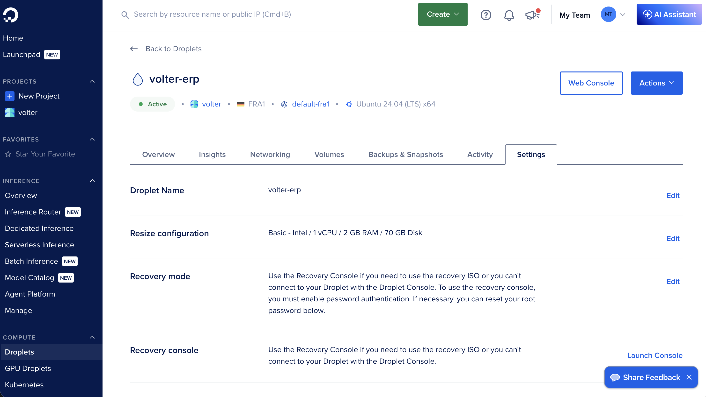
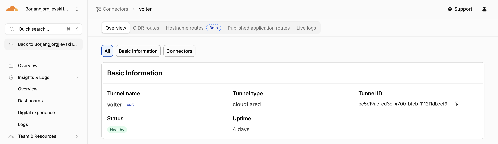
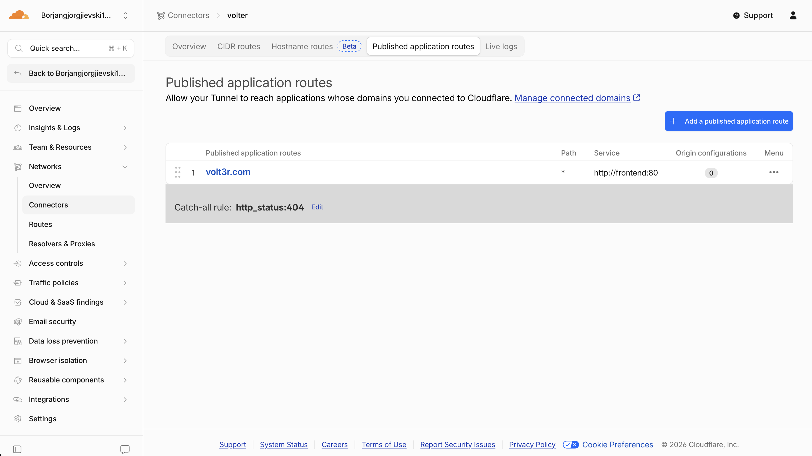
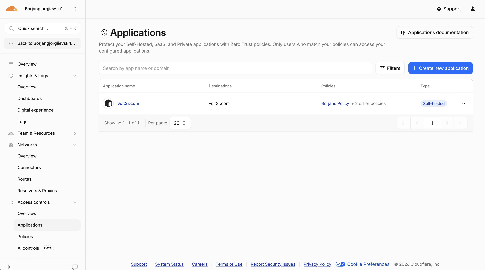

## 1. Апликацијата и архитектура

**Volter A&B** е multi-tenant ERP систем за ланец на заложни куќи (заложби, продажби,
клиенти, вработени, инвентар, каса, трошоци, извештаи). Се состои од три независни дела,
секој пакуван и испорачуван посебно:

| Слој     | Технологија                          |
|----------|--------------------------------------|
| Frontend | React + Tailwind + Vite + TypeScript |
| Backend  | Java Spring Boot                     |
| База     | PostgreSQL 16                        |

Системот има два одвоени текови:

- **Градба/објава (во облак):** `git push` → GitHub Actions (тестови → имиџи → GHCR) →
  (само на таг) автоматски deploy.
- **Извршување (на сервер):** корисник → Cloudflare (Access + Tunnel) → `cloudflared` →
  `frontend` (nginx) → `/api` → `backend` → `postgres`.

Клучна идеја: **GitHub Actions гради, GHCR чува, серверот само повлекува и пушта.**
Серверот никогаш не компајлира код и никогаш не отвора влезен порт кон интернетот.

## 2. Дел 1 — Јавен Git репозиториум

Целиот проект (backend, frontend, миграции, Docker и Compose датотеки, CI/CD pipeline и
Kubernetes манифести) е во еден јавен репозиториум: **github.com/80rjan/Volter**.
Гранката `main` е за интеграција и објавува тековен `edge` имиџ; **продукциско издание**
се прави само со семантички верзиониран таг `vX.Y.Z` (само тагот активира deploy).

## 3. Дел 2 — Докеризација

Двата слоја се пакувани со **повеќефазни (multi-stage) Dockerfile** датотеки — тешките
алатки за градба (Maven, Node) живеат само во привремена *build* фаза, а финалниот имиџ
носи само она што е потребно за извршување (помал и побезбеден).

- **Backend** (`backend/Dockerfile`): `maven:3.9.9-temurin-21` гради извршен JAR →
  `eclipse-temurin:21-jre-alpine` носи само JRE + `app.jar`. Тестовите се прескокнуваат
  тука (се вртат во CI).
- **Frontend** (`frontend/Dockerfile.prod`): `node:20-alpine` (`npm run build`) →
  `nginx:1.27-alpine` со статичните фајлови. `VITE_API_BASE` е *build-time* (Vite го
  вградува во bundle-от); во продукција е `/api`.
- **nginx као reverse proxy на ист origin** (`frontend/nginx.conf`): `/api/*` се проксира
  до `backend:8080`, сè друго е SPA. Така **нема CORS**, доволен е **еден TLS сертификат**,
  и **backend-от никогаш не е јавно изложен**.

```nginx
location /api/ { proxy_pass http://backend:8080/; }   # /api/pawns -> backend:8080/pawns
location /     { try_files $uri $uri/ /index.html; }   # SPA fallback
```

## 4. Дел 3 — Оркестрација со Docker Compose

Две Compose датотеки за двете околини — иста апликација, различно поврзана:

|                 | `docker-compose.dev.yml`        | `docker-compose.prod.yml`          |
|-----------------|---------------------------------|------------------------------------|
| Имиџи           | се градат локално (`build:`)    | се повлекуваат од GHCR (`image:`)  |
| База            | `5432` изложен (за GUI клиент)  | без јавен порт (само внатрешно)    |
| Frontend        | Vite dev server + hot reload    | статична nginx изградба            |
| Профил          | `dev` (со демо податоци)        | `prod` (без демо)                  |
| Јавен пристап   | `localhost`                     | Cloudflare Tunnel + Access         |

Оркестрациски концепти во прод стекот: **healthcheck + `depends_on: service_healthy`**
(нема тркачки состојби при старт), **именуван volume** (податоците на базата преживуваат
рестарт), **мрежна изолација** (сервисите се адресираат по име, а објавените порти се
врзани за `127.0.0.1`, не `0.0.0.0`), **`${IMAGE_TAG:-latest}`** (иста датотека пушта/враќа
било која верзија) и **`restart: always`**.

## 5. Дел 4 — CI/CD pipeline (GitHub Actions → GHCR)

Целиот pipeline е во `.github/workflows/ci-cd.yml`. Тригери: push на `main`, таг `v*.*.*`,
и pull request; `concurrency: cancel-in-progress` ги откажува застарените вртења.

| Настан              | Контрола | Објавени имиџи                          | Авто-deploy |
|---------------------|----------|-----------------------------------------|-------------|
| Pull request → main | ✅        | —                                       | —           |
| Push → main         | ✅        | `edge`, `sha-…`                         | —           |
| Push таг `vX.Y.Z`   | ✅        | `X.Y.Z`, `X.Y`, `X`, `latest`, `sha-…`  | ✅ на droplet |

**Фаза 1 — контрола на квалитет:** unit тестови (Maven Surefire), integration тестови
(Failsafe + **Testcontainers** со вистински PostgreSQL — не-блокирачки), и вистинска
продукциска изградба на frontend-от (`npm run build`).

**Фаза 2 — изградба и качување (`build-and-push`, само на push):** најава на GHCR со
вградениот `GITHUB_TOKEN`, `docker/metadata-action` генерира семејство тагови,
`docker/build-push-action` гради со Buildx + GitHub Actions layer cache. Frontend-от се
гради со `build-arg VITE_API_BASE=/api`.

**Семантичко верзионирање:** таг `v1.4.3` → `1.4.3`, `1.4`, `1`, `latest`, `sha-…`; push
на `main` → `edge`, `sha-…`. **GHCR наместо DockerHub:** иста сметка/дозволи како кодот,
автентикација преку вграден токен, приватни имиџи, без лимити на повлекување.

## 6. Дел 4 (бонус) — Continuous Deployment

Deploy job-от се пали **само на `v*` таг**, по успешен `build-and-push`. Чекори: решавање
на верзијата од тагот → поврзување на runner-от на **Tailscale** (OAuth, `tag:ci`) → SSH
во droplet-от → повлекување и рестарт:

```bash
IMAGE_TAG=1.1.0 docker compose --env-file .env.prod -f docker-compose.prod.yml pull
IMAGE_TAG=1.1.0 docker compose --env-file .env.prod -f docker-compose.prod.yml up -d
```

Серверот чува само две датотеки (`docker-compose.prod.yml` + `.env.prod`) и не гради
ништо — само повлекува готови имиџи од GHCR.

## 7. Дел 5 — Kubernetes

Манифестите се во `k8s/` и претставуваат алтернативна оркестрација на кластер со истите
GHCR имиџи, но со декларативни манифести, self-healing, replicas и service discovery.

- **Namespace** (`k8s/00-namespace.yaml`) — изолација на сите ресурси во `volter`.
- **ConfigMap + Secret** (`k8s/01-config.yaml`, `k8s/02-secrets.example.yaml`) — не-тајна
  конфигурација одделно од тајните; за приватните имиџи се додава **imagePullSecret**.
- **StatefulSet за базата** (`k8s/03-postgres-statefulset.yaml`) — стабилно име
  (`volter-postgres-0`), стабилен диск преку **`volumeClaimTemplates`** и **headless
  Service** за предвидлив DNS.
- **Deployment** за backend и frontend (`k8s/04-…`, `k8s/05-…`) — stateless, по 2 replicas,
  rolling update, readiness/liveness probes на `/actuator/health`.
- **Service** (`k8s/06-services.yaml`) — ClusterIP; backend Service се вика **`backend:8080`**
  за да работи nginx-от непроменет како во Compose.
- **Ingress** (`k8s/07-ingress.yaml`) — единствен влез (`erp.volter.local`) кон frontend-от;
  nginx внатре го проксира `/api` кон backend-от (backend никогаш директно изложен).

Демонстрација: `kubectl apply -f k8s/`, потоа `kubectl get all -n volter` (сите pod-ови
`Running`, PVC `Bound`, Ingress со адреса).

## 8. Инфраструктура и безбедност

Целото поставување е изградено околу едно правило: **серверот не отвора ниту еден влезен
порт**; до сè се доаѓа преку канали иницирани одвнатре.

- **DigitalOcean droplet** — Ubuntu + Docker; Cloud Firewall дозволува влез само за SSH,
  а излез за сè. Ништо друго не е јавно објавено.
- **Cloudflare Tunnel** — `cloudflared` се поврзува **излезно** кон Cloudflare; нема влезен
  порт, вистинското IP е скриено, целиот сообраќај оди низ Cloudflare.
- **Cloudflare Access (Zero Trust)** — идентитетска порта пред апликацијата (политики по
  е-пошта + IP за секоја продавница).
- **Tailscale** — CI деплојира преку приватна mesh VPN (WireGuard) **без отворен SSH порт**;
  runner-от се приклучува со ephemeral `tag:ci` node што исчезнува по job-от.
- **Одбрана во длабочина** — секое барање минува низ: Cloudflare Access → JWT најава →
  улоги/дозволи → firewall без објавени порти.

**DigitalOcean droplet + Cloud Firewall:**



**Cloudflare Tunnel (Public Hostname) и Access (Zero Trust):**







## 9. Управување со тајни

Ништо чувствително не е committ-ирано. Тајните стојат на две места: **`.env.prod`**
(gitignored) на серверот за Compose, и **GitHub Actions secrets** за pipeline-от
(`GITHUB_TOKEN`, Tailscale OAuth, `DROPLET_*`). `SPRING_PROFILES_ACTIVE: prod` е тврдо
запишан во Compose (не во env) за да не може лоша env датотека да ја префрли продукцијата
во dev режим. Серверот прави еднократен `docker login ghcr.io` со PAT ограничен на
`read:packages`. Во Kubernetes улогата ја играат `Secret` + `imagePullSecret`.

## 10. Зошто овие алатки (резиме на одлуките)

| Одлука                              | Зошто                                                                       |
|-------------------------------------|-----------------------------------------------------------------------------|
| GitHub Actions + GHCR               | Вградени во репото, без сервер за одржување, токен наместо чувана лозинка    |
| Повеќефазни имиџи (backend + nginx) | Малечки, побезбедни runtime имиџи; чист `/api` proxy на ист origin           |
| Семантички таг-ови како тригер      | Развивачот одлучува *кога* и *каков* е изданието; изданијата се следливи     |
| `docker compose pull` на серверот   | Серверот останува минимален и поставува точно тоа што CI го тестирал         |
| Kubernetes                          | Декларативна оркестрација со self-healing, StatefulSet, Service и Ingress    |
| Cloudflare Tunnel + Access          | Нула влезни порти, скриено IP, идентитетска порта пред апликацијата          |
| Tailscale за CD                     | CI го достигнува серверот без отворен SSH порт                               |
