# Volter A&B — Документација за предметот КИИ

> Предмет: **Континуирана Интеграција и Испорака**  
> Апликација: **Volter A&B** — ERP систем за ланец на заложни куќи.  
> Автор: Борјан Ѓорѓиевски  
> Репозиториум: `https://github.com/80rjan/Volter`

Во овој документ е објаснет **DevOps делот** од проектот: како апликацијата е спакувана
во контејнери, како се оркестрирани со Docker Compose, како се градат и
објавуваат images преку CI/CD pipeline, и на крај како автоматски се поставуваат на
продукциски сервер. Покрај тоа, опишан е и мрежниот и безбедносниот слој
(Cloudflare, Tailscale, DigitalOcean) што го прави целото поставување безбедно.

---

## Содржина

1. [Што е апликацијата](#1-што-е-апликацијата)
2. [Архитектура на високо ниво](#2-архитектура-на-високо-ниво)
3. [Дел 1 — Јавен Git репозиториум](#3-дел-1--јавен-git-репозиториум)
4. [Дел 2 — Докеризација на апликацијата](#4-дел-2--докеризација-на-апликацијата)
5. [Дел 3 — Оркестрација со Docker Compose](#5-дел-3--оркестрација-со-docker-compose)
6. [Дел 4 — CI/CD pipeline (GitHub Actions → GHCR)](#6-дел-4--cicd-pipeline-github-actions--ghcr)
7. [Дел 4 (бонус) — Continuous Deployment на серверот](#7-дел-4-бонус--continuous-deployment-на-серверот)
8. [Дел 5 — Kubernetes (манифести и деплој на кластер)](#8-дел-5--kubernetes-манифести-и-деплој-на-кластер)
9. [Инфраструктура и безбедност во детали](#9-инфраструктура-и-безбедност-во-детали)
10. [Управување со тајни и конфигурација](#10-управување-со-тајни-и-конфигурација)
11. [Целосен тек на едно издание (release)](#11-целосен-тек-на-едно-издание-release)
12. [Зошто овие алатки (одлуки во дизајнот)](#12-зошто-овие-алатки-одлуки-во-дизајнот)
13. [Додаток — мапа на датотеки](#13-додаток--мапа-на-датотеки)

---

## 1. Што е апликацијата

**Volter A&B** е multi-tenant ERP систем за водење ланец на заложни куќи —
покрива заложби, продажби, клиенти, вработени, инвентар, каса, трошоци, нотификации и извештаи.
Составена е од три независни дела, при што секој се пакува и испорачува посебно:

| Слој         | Технологија                          |
|--------------|--------------------------------------|
| **Frontend** | React + Tailwind + Vite + TypeScript |
| **Backend**  | Java Spring Boot                     |
| **База**     | PostgreSQL 16                        |

---

## 2. Архитектура на високо ниво

Целиот систем има два сосема одвоени текови: текот на **градба и објава** (лево, се
одвива во облакот) и текот на **извршување** (десно, на серверот плус рабовите на
Cloudflare).

**Тек на градба/објава (во облакот):**

```
  [ Лаптоп ]
   git push (гранка / таг)
        |
        v
  +============================ GitHub Actions (CI/CD) ============================+
  |  Контрола на квалитет   -->   Изградба на имиџи   -->   Качување на GHCR       |
  |  (unit + integration         (backend + frontend)      (верзионирани таг-ови)  |
  |   + frontend build)                                                            |
  +=======================================+========================================+
                                          | docker push
                                          v
                        +-----------------------------------+
                        |  GHCR — приватен регистар         |
                        |   ghcr.io/80rjan/volter-backend   |
                        |   ghcr.io/80rjan/volter-frontend  |
                        +-----------------+-----------------+
                                          | docker pull
   git push на таг  -- Deploy job --------+ (SSH преку Tailscale)
   (само vX.Y.Z)                          v
                        +-----------------------------------+
                        |  DigitalOcean droplet             |
                        |   docker compose pull + up -d     |
                        +-----------------------------------+
```

**Тек на извршување (на серверот + Cloudflare):**

```
  [ Вработени ]        +-------- Cloudflare раб --------+        +---- DigitalOcean droplet ----+
   прелистувач  ------>| Cloudflare Access (Zero Trust)|        |                              |
                       |              |                |        |   cloudflared (tunnel)       |
                       |              v                | <======|   се поврзува ИЗЛЕЗНО        |
                       |       Cloudflare Tunnel       | тунел  |        |                     |
                       +-------------------------------+        |        v                     |
                                                                |   frontend (nginx)           |
                                                                |        |  /api                |
                                                                |        v                     |
                                                                |   backend  -->  postgres:16  |
                                                                +------------------------------+
```

Целата идеја се сведува на едно: **GitHub Actions гради, GHCR чува, а droplet-от само
повлекува и пушта.** Серверот никогаш не компајлира код и никогаш не отвора влезна порта
кон интернетот.

---

## 3. Дел 1 — Јавен Git репозиториум

Сè што го сочинува проектот — backend-от, frontend-от, миграциите на базата, Docker
датотеките, Compose датотеките и самиот CI/CD pipeline — стои во еден GitHub
репозиториум:

> **https://github.com/80rjan/Volter**

Вака изгледа структурата на највисоко ниво:

```
Volter/
├── backend/                  Spring Boot сервис
│   ├── Dockerfile            повеќефазна изградба → имиџ со извршен JAR
│   ├── pom.xml               Maven изградба 
│   └── src/                  апликација + тестови
├── frontend/                 React SPA (Vite + TypeScript)
│   ├── Dockerfile.prod       повеќефазна изградба → nginx имиџ
│   ├── Dockerfile.dev        dev имиџ со hot-reload
│   ├── nginx.conf            статичко сервирање + /api reverse proxy
│   └── src/
├── k8s/                      Kubernetes манифести (Дел 5)
├── docker-compose.dev.yml    локален development стек (гради локално)
├── docker-compose.prod.yml   продукциски стек (повлекува готови имиџи)
├── .github/workflows/
│   └── ci-cd.yml             CI/CD pipeline-от
├── DEPLOYMENT.md             оперативно упатство
└── CI-CD-PROJECT.md          овој документ
```

`main` е гранката на која сè се спојува. Секој push на `main` се гради и се објавува
како тековен `edge` имиџ (користено за брза проверка во staging), но **не** оди во
продукција.
**Продукциско издание** се прави кога ќе се прикачи **семантички верзиониран таг**
(`vX.Y.Z`). Само таговите го активираат поставувањето на серверот.

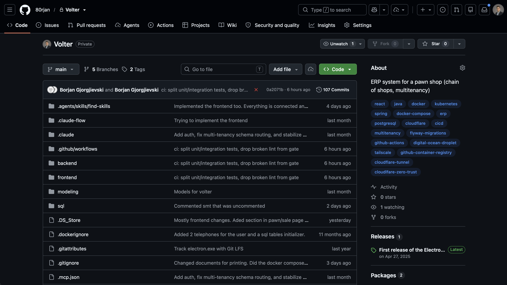

---

## 4. Дел 2 — Докеризација на апликацијата

И двата апликациски слоја се контејнеризирани со **повеќефазни (multi-stage) Dockerfile**
датотеки. „Повеќефазно" значи дека тешките алатки за градба (Maven, Node) живеат само во
привремена *build* фаза, додека финалниот имиџ носи **само она што е потребно за
извршување**. Така имиџот излегува мал.

### 4.1 Backend имиџ — `backend/Dockerfile`

```dockerfile
FROM maven:3.9.9-eclipse-temurin-21 AS build
WORKDIR /app
COPY pom.xml .
RUN mvn dependency:go-offline -B        # се кешираат зависности во посебен слој
COPY src ./src
RUN mvn clean package -DskipTests       # тестовите се извршуваат во CI, не тука

FROM eclipse-temurin:21-jre-alpine      # мал runtime само со JRE
WORKDIR /app
# curl го користи docker-compose healthcheck за да проба /actuator/health
RUN apk add --no-cache curl
COPY --from=build /app/target/*.jar app.jar
EXPOSE 8080
ENTRYPOINT ["java", "-jar", "app.jar"]
```

Што прави секој дел и зошто е тоа така:

- **Фаза 1 (`build`)** го користи целиот Maven + JDK 21 имиџ за да го компајлира
  проектот и да испорача еден извршен Spring Boot JAR.
- Прво се копира `pom.xml` и се пушта `mvn dependency:go-offline`, па дури потоа
  се копира изворниот код, со цел ефикасно кеширање на слоеви: сè додека `pom.xml` не се
  менува, Docker го користи веќе кешираниот слој со зависности и повторно компајлира само
  она што навистина се променило (пример кодот) — што значи многу побрзи градби во CI.
- `-DskipTests` — тестовите намерно **не** се извршуваат при градбата на имиџот. Тие се
  извршуваат како посебен чекор во pipeline-от (види Дел 4).
- **Фаза 2 (runtime)** е `eclipse-temurin:21-jre-alpine` — минимален Alpine имиџ што
  носи само Java *runtime* (без компајлер, без Maven). Од претходната фаза се повлекува
  единствено готовиот `app.jar`.
- `curl` е додадено за да може Compose да направи HTTP health-проверка на Spring
  Boot преку `/actuator/health`.

### 4.2 Frontend имиџ — `frontend/Dockerfile.prod`

```dockerfile
# Продукциски frontend: изгради го статичкиот SPA, потоа сервирај го со nginx.
FROM node:20-alpine AS build
WORKDIR /app/frontend
COPY package*.json ./
RUN npm install
COPY . .
# Vite ги вградува VITE_* променливите во bundle-от во моментот на изградба, па
# URL-то на API мора да се даде тука (преку build arg) наместо при извршување.
ARG VITE_API_BASE
ENV VITE_API_BASE=$VITE_API_BASE
RUN npm run build

FROM nginx:1.27-alpine
COPY --from=build /app/frontend/dist /usr/share/nginx/html
COPY nginx.conf /etc/nginx/conf.d/default.conf
EXPOSE 80
CMD ["nginx", "-g", "daemon off;"]
```

Што прави секој дел и зошто е тоа така:

- **Фаза 1** го користи Node за да го изгради статичкиот bundle (`dist/`) со
  `npm run build`.
- **`ARG VITE_API_BASE`** се користи за Vite, кој работи во *compile-time* —
  променливите со префикс `VITE_` кои се **вградуваат директно во JavaScript bundle-от
  додека се гради**, а не се читаат при извршување. Затоа базната патека на API мора да
  се предаде како Docker **build аргумент**. Во продукција таа е секогаш `"/api"` (ист
  origin), па pipeline-от испраќа `VITE_API_BASE=/api`.
- **Фаза 2** е чист `nginx:1.27-alpine`. Готовиот `dist/` се копира во веб-коренот на
  nginx и се приложува `nginx.conf`. Во финалниот имиџ нема ни Node, ни изворен
  код — само nginx и компајлираните датотеки.

### 4.3 nginx како reverse proxy на ист origin — `frontend/nginx.conf`

```nginx
server {
    listen 80;
    server_name _;
    root /usr/share/nginx/html;
    index index.html;

    # API на ист origin: прелистувачот вика /api/*, што се проксира до
    # backend-от преку внатрешната Docker мрежа. Завршниот / го отстранува префиксот:
    # /api/pawns -> backend:8080/pawns.
    location /api/ {
        proxy_pass http://backend:8080/;
        proxy_set_header Host $host;
        proxy_set_header X-Real-IP $remote_addr;
        proxy_set_header X-Forwarded-For $proxy_add_x_forwarded_for;
        proxy_set_header X-Forwarded-Proto $scheme;
    }

    # SPA fallback: сервирај index.html за било која рута на клиентската страна.
    location / {
        try_files $uri $uri/ /index.html;
    }

    # Фингерпринтираните build assets може агресивно да се кешираат.
    location /assets/ {
        expires 1y;
        add_header Cache-Control "public, immutable";
    }
}
```

Ова е срцето на архитектурата. Прелистувачот секогаш разговара со **само еден origin**
(`https://erp.<domen>`):

```
https://erp.<domen>/            → nginx го сервира интерфејсот (HTML/JS/CSS)
https://erp.<domen>/api/pawns   → nginx проксира до backend:8080/pawns
```

### 4.4 `.dockerignore`

Секој build контекст има свој `.dockerignore` (`backend/.dockerignore` и
`frontend/.dockerignore`), за да остане контекстот мал и за да тајните никогаш не завршат
во имиџите (`node_modules`, `dist`, `.git`, `.idea`, `*.log` и слично се исфрлени).


---

## 5. Дел 3 — Оркестрација со Docker Compose

Трите сервиси (база + backend + frontend) плус Cloudflare тунелот се оркестрираат со
Docker Compose. Има **две** compose датотеки, по една за секоја околина — иста
апликација, само различно поврзана:

|                 | `docker-compose.dev.yml`                        | `docker-compose.prod.yml`                       |
|-----------------|-------------------------------------------------|-------------------------------------------------|
| Имиџи           | **се градат локално** (`build:`)                | **се повлекуваат од GHCR** (`image:`)           |
| Порти на базата | `5432` изложен (за GUI клиент)                  | **нема** достапни јавни порти (само внатрешно)  |
| Frontend        | Vite dev server + hot reload (bind mount)       | статична nginx изградба                         |
| Демо податоци   | преку миграција за демо податоци (`dev` профил) | нема миграција за демо податоци (`prod` профил) |
| Јавен пристап   | `localhost`                                     | Cloudflare Tunnel + Access                      |

### 5.1 Продукциски стек — `docker-compose.prod.yml`

```yaml
services:
  postgres:
    image: postgres:16-alpine
    container_name: volter_db_prod
    ports:
      - "127.0.0.1:5432:5432"        # врзан само за localhost, никогаш за интернет
    environment:
      POSTGRES_USER: ${POSTGRES_USER}
      POSTGRES_PASSWORD: ${POSTGRES_PASSWORD}
      POSTGRES_DB: ${POSTGRES_DB}
      TZ: Europe/Skopje
      PGTZ: Europe/Skopje
    volumes:
      - volter_pgdata_prod:/var/lib/postgresql/data   # именуван volume = податоците преживуваат рестарт
    healthcheck:
      test: [ "CMD-SHELL", "pg_isready -U ${POSTGRES_USER} -d ${POSTGRES_DB}" ]
      interval: 10s
      timeout: 5s
      retries: 5
    restart: always

  backend:
    image: ghcr.io/80rjan/volter-backend:${IMAGE_TAG:-latest}
    container_name: volter_backend_prod
    environment:
      SPRING_PROFILES_ACTIVE: prod
      SPRING_DATASOURCE_URL: jdbc:postgresql://postgres:5432/${POSTGRES_DB}
      SPRING_DATASOURCE_USERNAME: ${POSTGRES_USER}
      SPRING_DATASOURCE_PASSWORD: ${POSTGRES_PASSWORD}
      JWT_CONFIG_SECRET: ${JWT_CONFIG_SECRET}
      ALLOWED_ORIGINS: ${ALLOWED_ORIGINS}
      GOLD_API_KEY: ${GOLD_API_KEY:-}
    expose:
      - "8080"                        # само внатрешна мрежа, без порт на хостот
    depends_on:
      postgres:
        condition: service_healthy    # backend чека додека базата навистина не е спремна
    healthcheck:
      test: [ "CMD-SHELL", "curl -fsS http://localhost:8080/actuator/health || exit 1" ]
      interval: 10s
      timeout: 5s
      retries: 5
      start_period: 60s
    restart: always

  frontend:
    image: ghcr.io/80rjan/volter-frontend:${IMAGE_TAG:-latest}
    container_name: volter_frontend_prod
    ports:
      - "127.0.0.1:8081:80"           # само localhost, за дебагирање на серверот
    depends_on:
      backend:
        condition: service_healthy
    restart: always

  cloudflared:
    image: cloudflare/cloudflared:latest
    container_name: volter_cloudflared
    command: tunnel --no-autoupdate run --token ${TUNNEL_TOKEN}
    depends_on:
      - frontend
    restart: always

volumes:
  volter_pgdata_prod:
    driver: local
```

Еве кои концепти на оркестрација ги покажува овој фајл:

- **Зависности меѓу сервисите со проверка преку health** — `depends_on: { condition:
  service_healthy }` значи дека backend-от нема да стартува додека Postgres не помине
  `pg_isready`, а frontend-от нема да стартува додека backend `/actuator/health` не
  светне зелено.
- **Healthcheck** на секој долготраен сервис, за да знае Docker (и deploy job-от) дали
  контејнерот навистина сервира, а не само дали е „пуштен".
- **Именуван volume** (`volter_pgdata_prod`) — податоците на базата стојат во volume што
  го менаџира Docker, па **преживуваат** `docker compose down`/`up` и надградби на
  имиџи.
- **Изолирана мрежа** — Compose стандардно ги става сите сервиси на една приватна bridge
  мрежа, на која се адресираат меѓусебно **по име на сервис** (`postgres`,
  `backend:8080`, `frontend:80`). Од таа мрежа излегуваат само портите што експлицитно
  се објавени, а и тие се врзани за `127.0.0.1` (localhost на droplet-от), никогаш за
  `0.0.0.0`. Така **ништо од стекот не е директно изложено кон јавниот интернет** —
  јавниот сообраќај влегува исклучиво преку Cloudflare тунелот.
- **Фиксирање на имиџ преку `${IMAGE_TAG:-latest}`** — истата compose датотека може да
  пушти било која објавена верзија. Deploy job-от го поставува `IMAGE_TAG` на верзијата
  што се издава; рачен rollback е едноставно `IMAGE_TAG=1.4.2 docker compose ... up -d`.
- **`restart: always`** — стекот сам се крева повторно по рестарт или пад.

### 5.2 Development стек — `docker-compose.dev.yml`

Dev стекот **гради** имиџи локално наместо да ги повлекува, го изложува Postgres на
`5432` за GUI клиент, го пушта backend-от со `dev` профилот (па се сеедираат демо
податоци) и го врти frontend-от како **Vite dev server со hot module reload**, преку
bind-mount на изворниот код од хостот во контејнерот:

```yaml
# =====================================================================
# Volter — DEVELOPMENT stack
#
#   docker compose --env-file .env.dev -f docker-compose.dev.yml up --build
#
# Throwaway dev database (its own volume) + hot-reloading Vite frontend.
# The backend runs the `dev` profile, so demo data IS seeded.
# Secrets/values come from .env.dev (copy from .env.dev).
# =====================================================================
services:
  postgres:
    image: postgres:16-alpine
    container_name: volter_db_dev
    environment:
      POSTGRES_USER: ${POSTGRES_USER}
      POSTGRES_PASSWORD: ${POSTGRES_PASSWORD}
      POSTGRES_DB: ${POSTGRES_DB}
      TZ: Europe/Skopje
      PGTZ: Europe/Skopje
    ports:
      # Exposed so you can inspect the dev DB with a GUI client.
      - "5432:5432"
    volumes:
      - volter_pgdata_dev:/var/lib/postgresql/data
    command:
      - "postgres"
      - "-c"
      - "timezone=Europe/Skopje"
      - "-c"
      - "log_timezone=Europe/Skopje"
    healthcheck:
      test: [ "CMD-SHELL", "pg_isready -U ${POSTGRES_USER} -d ${POSTGRES_DB}" ]
      interval: 10s
      timeout: 5s
      retries: 5
    restart: unless-stopped

  backend:
    build:
      context: ./backend
      dockerfile: Dockerfile
    container_name: volter_backend_dev
    environment:
      # Profile is intrinsic to this file → demo seeding ON.
      SPRING_PROFILES_ACTIVE: dev
      TZ: Europe/Skopje
      SPRING_DATASOURCE_URL: jdbc:postgresql://postgres:5432/${POSTGRES_DB}
      SPRING_DATASOURCE_USERNAME: ${POSTGRES_USER}
      SPRING_DATASOURCE_PASSWORD: ${POSTGRES_PASSWORD}
      JWT_CONFIG_SECRET: ${JWT_CONFIG_SECRET}
      ALLOWED_ORIGINS: ${ALLOWED_ORIGINS}
      GOLD_API_KEY: ${GOLD_API_KEY:-}
    ports:
      - "8080:8080"
    depends_on:
      postgres:
        condition: service_healthy
    healthcheck:
      test: [ "CMD-SHELL", "curl -fsS http://localhost:8080/actuator/health || exit 1" ]
      interval: 10s
      timeout: 5s
      retries: 5
      start_period: 40s
    restart: unless-stopped

  frontend:
    build:
      context: ./frontend
      dockerfile: Dockerfile.dev
    container_name: volter_frontend_dev
    # Live-reload: mount host source so Vite HMR picks up edits; the anonymous
    # volume keeps the container's node_modules from being shadowed by the host.
    volumes:
      - ./frontend:/app/frontend
      - /app/frontend/node_modules
    environment:
      CHOKIDAR_USEPOLLING: "true"
    ports:
      - "5173:5173"
    depends_on:
      backend:
        condition: service_healthy
    restart: unless-stopped

volumes:
  volter_pgdata_dev:
    driver: local
```

Локално за старт на целиот стек се користи:

```bash
docker compose --env-file .env.dev -f docker-compose.dev.yml up --build
```

Во прилог е слика од `docker ps` на продукцискиот сервер, каде се гледаат сите контејнери што се пуштени од Compose:
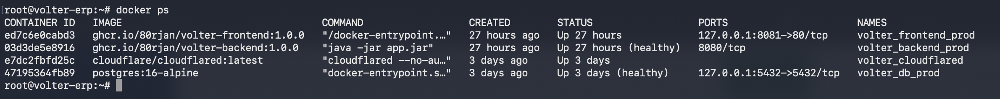

---

## 6. Дел 4 — CI/CD pipeline (GitHub Actions → GHCR)

CI платформа која се користи во проектот е  **GitHub Actions**. Целиот pipeline е прикажан во една workflow
датотека: `.github/workflows/ci-cd.yml`.

### 6.1 Зошто GitHub Actions + GHCR

- **GitHub Actions** е вграден во самиот репозиториум — нема посебен сервер за
  одржување (за разлика од self-hosted Jenkins) и нема потреба одделен CI акаунт (за разлика од
  GitLab CI кога кодот е на GitHub). Workflow-ите се вртат на runner-и што ги
  обезбедува GitHub и реагираат на настани во репото (push, tag, PR).
- **GHCR (GitHub Container Registry)** наместо DockerHub, поради неколку причини:
    - Стои покрај кодот, под истиот акаунт и истите дозволи.
    - Внатре во Actions, качувањето се автентицира со **вградениот `GITHUB_TOKEN`** —
      нема долготрајна лозинка за регистар што треба да се чува некаде.
    - Бесплатниот ранг на DockerHub има лимити на стапка на повлекување (а сега и лимити
      на задржување на имиџи); GHCR е многу подарежлив за приватни имиџи врзани за репото.
    - Пакетите може да останат **приватни**, а серверот сепак да ги повлекува со тесно
      ограничен токен (`read:packages`).

### 6.2 Тригери

```yaml
on:
  push:
    branches: [ main ]
    tags: [ "v*.*.*" ]
  pull_request:
    branches: [ main ]

concurrency:
  group: ci-cd-${{ github.ref }}
  cancel-in-progress: true
```

| Настан                    | Контрола на квалитет | Објавени имиџи                                | Авто-deploy  |
|---------------------------|----------------------|-----------------------------------------------|--------------|
| **Pull request → `main`** | ✅                    | —                                             | —            |
| **Push → `main`**         | ✅                    | `edge`, `sha-<commit>`                        | —            |
| **Push таг `vX.Y.Z`**     | ✅                    | `X.Y.Z`, `X.Y`, `X`, `latest`, `sha-<commit>` | ✅ на droplet |

`concurrency` со `cancel-in-progress` значи дека понов push на истата ref ја откажува
работата што сè уште трае, за да не се троши runner-от на застарени commit-и.

### 6.3 Фаза 1 — контролата на квалитет

Пред да се објави било што, три job-а ги вртат тестовите и градбата. Тестовите на
backend-от намерно се **поделени** на брзи unit тестови и побавни integration тестови што
бараат Docker (зошто — види 6.6), користејќи ги Maven Surefire (unit) и Failsafe
(integration) plugin-ите.

```yaml
  backend-test: # брзи unit тестови, без Docker
    name: Backend unit tests
    runs-on: ubuntu-latest
    steps:
      - uses: actions/checkout@v4
      - uses: actions/setup-java@v4
        with: { distribution: temurin, java-version: "21", cache: maven }
      - name: Run unit tests
        working-directory: backend
        run: |
          chmod +x mvnw
          ./mvnw -B clean test        # Surefire ги исклучува *IntegrationTest

  backend-it: # integration тестови со вистински PostgreSQL (Testcontainers)
    name: Backend integration tests (Testcontainers)
    runs-on: ubuntu-latest
    continue-on-error: true          # засега не-блокирачки (види 6.6)
    steps:
      - uses: actions/checkout@v4
      - uses: actions/setup-java@v4
        with: { distribution: temurin, java-version: "21", cache: maven }
      - name: Run integration tests
        working-directory: backend
        run: |
          chmod +x mvnw
          ./mvnw -B clean verify      # Failsafe ги врти *IntegrationTest

  frontend-check: # frontend контролата = вистинска продукциска изградба
    name: Frontend build
    runs-on: ubuntu-latest
    steps:
      - uses: actions/checkout@v4
      - uses: actions/setup-node@v4
        with: { node-version: "20", cache: npm, cache-dependency-path: frontend/package-lock.json }
      - name: Install dependencies
        working-directory: frontend
        run: npm ci
      - name: Build
        working-directory: frontend
        run: npm run build
```

- `cache: maven` / `cache: npm` го чуваат кешот на зависности меѓу вртења, заради
  брзина.
- Се користи `npm ci` (а не `npm install`), за да се инсталираат точно заклучените
  верзии — резултатот е репродуцибилен.
- Frontend контролата ја врти **вистинската продукциска изградба** (`npm run build`),
  истиот чекор што го прави и Docker градбата на имиџот. Така, ако bundle-от не може да
  се изгради, pipeline-от паѓа *пред* да губи време градејќи имиџи.

### 6.4 Фаза 2 — градба и качување на имиџи на GHCR

Ова е јадрото на барањето: **при push, новата верзија на имиџот се објавува на
регистар.**

```yaml
  build-and-push:
    name: Build & push images to GHCR
    needs: [ backend-test, frontend-check ]    # се врти само ако контролата е зелена
    if: github.event_name == 'push'          # никогаш на PR-ови
    runs-on: ubuntu-latest
    permissions:
      contents: read
      packages: write                        # потребно за качување на GHCR
    steps:
      - uses: actions/checkout@v4
      - uses: docker/setup-buildx-action@v3

      - name: Log in to GHCR
        uses: docker/login-action@v3
        with:
          registry: ghcr.io
          username: ${{ github.actor }}
          password: ${{ secrets.GITHUB_TOKEN }}   # вграден токен, без чувана тајна

      - name: Backend image metadata
        id: meta-backend
        uses: docker/metadata-action@v5
        with:
          images: ghcr.io/${{ github.repository_owner }}/volter-backend
          tags: |
            type=raw,value=edge,enable=${{ github.ref == 'refs/heads/main' }}
            type=sha,format=short
            type=semver,pattern={{version}}
            type=semver,pattern={{major}}.{{minor}}
            type=semver,pattern={{major}}
            type=raw,value=latest,enable=${{ startsWith(github.ref, 'refs/tags/v') }}

      - name: Build & push backend
        uses: docker/build-push-action@v6
        with:
          context: ./backend
          file: ./backend/Dockerfile
          push: true
          tags: ${{ steps.meta-backend.outputs.tags }}
          labels: ${{ steps.meta-backend.outputs.labels }}
          cache-from: type=gha,scope=backend
          cache-to: type=gha,mode=max,scope=backend

      # ... идентичен блок го гради и качува frontend имиџот, дополнително
      # предавајќи build-args: VITE_API_BASE=/api
```

Што прави овој job:

1. **Се најавува на GHCR** со автоматски обезбедениот `GITHUB_TOKEN` (нема тајна за
   менаџирање), а дозволата `packages: write` важи само за овој job.
2. **`docker/metadata-action`** го пресметува множеството тагови од git ref (види 6.5).
3. **`docker/build-push-action`** го гради секој имиџ со **Buildx** и ги качува сите
   пресметани тагови одеднаш.
4. **GitHub Actions кешот на слоеви** (`type=gha`) ги кешира Docker слоевите меѓу вртења,
   со посебен `scope` по имиџ за да не се мешаат — со што повторните градби се
   драстично побрзи.

Frontend блокот е истиот, само со додаток `build-args: VITE_API_BASE=/api`, за да се
вгради API патеката на ист origin во bundle-от (Дел 4.2).

### 6.5 Тагирање на имиџи — семантичко верзионирање преку git таг

Верзијата на изданието **ја одлучува развивачот** преку git тагот, следејќи го
[SemVer](https://semver.org/) стандардот:

```bash
git tag v1.4.3 && git push origin v1.4.3   # поправка на баг → PATCH
git tag v1.5.0 && git push origin v1.5.0   # нова функција  → MINOR
git tag v2.0.0 && git push origin v2.0.0   # пробивна промена → MAJOR
```

Од еден таг како `v1.4.3`, `metadata-action` генерира цело семејство тагови, за да
потрошувачите можат да се закачат на онаа прецизност што им треба:

| Изворна ref    | Таг-ови качени на GHCR                        |
|----------------|-----------------------------------------------|
| push на `main` | `edge`, `sha-<commit>`                        |
| таг `v1.4.3`   | `1.4.3`, `1.4`, `1`, `latest`, `sha-<commit>` |

- `1.4.3` = точно, непроменливо издание (ова се користи за фиксирање или rollback).
- `1.4` / `1` = „последната закрпа на 1.4" / „последното на major 1" — подвижни
  покажувачи.
- `latest` = најновото издание воопшто.
- `edge` = најновата градба од `main` (корисна за брза проверка во staging, никогаш не
  оди на продукција).
- `sha-<commit>` = води до точниот commit од кој е граден.

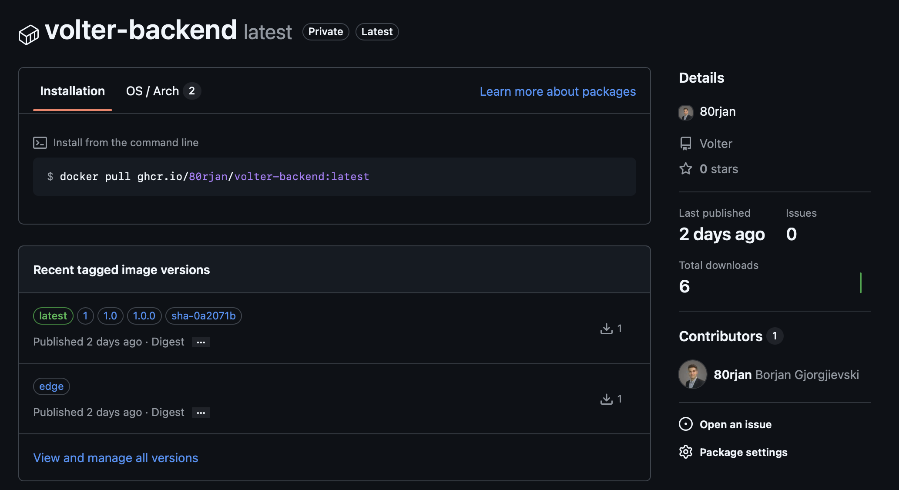
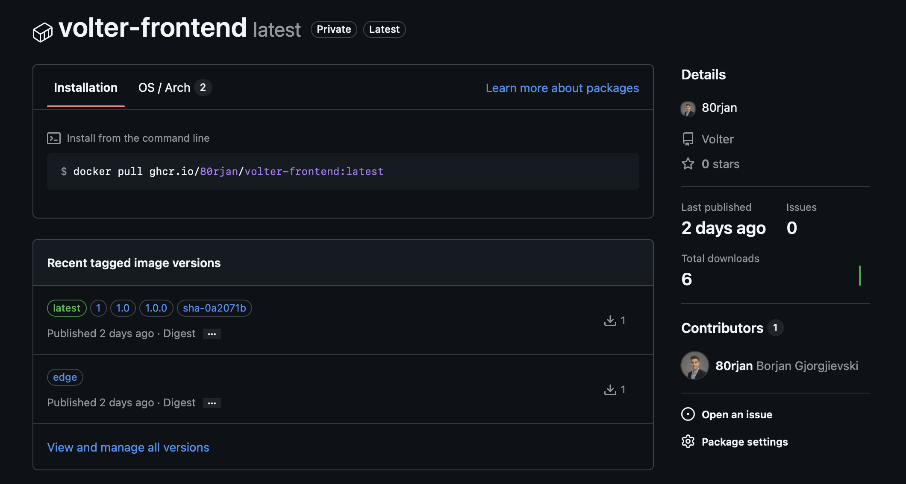

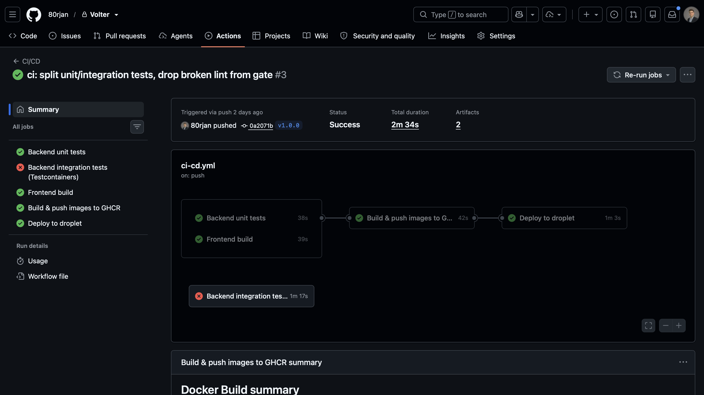


### 6.6 Зошто integration тестовите се одделени и не-блокирачки

Backend-от има два вида тестови:

- **Unit тестови** (`*Test`) — чиста логика, мокирани репозиториуми, без база. Брзи и
  детерминистички.
- **Integration тестови** (`*IntegrationTest`) — го кренуваат целиот Spring контекст
  врз **вистински PostgreSQL** што го стартува **Testcontainers** (привремен
  `postgres:16-alpine` контејнер), па затоа им треба функционален Docker daemon.

Maven е наместен (во `backend/pom.xml`) така што Surefire ги врти unit тестовите во
фазата `test`, а Failsafe ги врти integration тестовите во фазата `verify`:

```xml

<plugin>
    <artifactId>maven-surefire-plugin</artifactId>
    <configuration>
        <excludes>
            <exclude>**/*IntegrationTest.java</exclude>
        </excludes>
    </configuration>
</plugin>
<plugin>
<artifactId>maven-failsafe-plugin</artifactId>
<configuration>
    <includes>
        <include>**/*IntegrationTest.java</include>
    </includes>
</configuration>
<executions>
    <execution>
        <goals>
            <goal>integration-test</goal>
            <goal>verify</goal>
        </goals>
    </execution>
</executions>
</plugin>
```

Поентата е задолжителната контрола да остане **брза и детерминистичка** (unit тестови,
без Docker), додека integration тестовите се вртат во свој job само за сигнал. Засега
integration job-от е `continue-on-error: true` и **не** е во `needs` на build job-от, па
некоја пречка зависна од околината (на пример проблем со Testcontainers или Docker-API
на runner-от) никогаш не може да блокира издание. Откако ќе биде стабилно зелен на
runner-от, доволно е да се префрли `continue-on-error` на `false` и да се додаде
`backend-it` во `needs` — и тогаш станува тврда контрола.

---

## 7. Дел 4 (бонус) — Continuous Deployment на серверот

Ова е опционалниот CD бонус: pipeline-от **завршува со поставување** на издадената
верзија на продукцискиот сервер, преку Docker (Compose) оркестрација на самиот droplet
(deploy job-от во `.github/workflows/ci-cd.yml`).

```yaml
  deploy:
    name: Deploy to droplet
    needs: build-and-push
    if: github.event_name == 'push' && startsWith(github.ref, 'refs/tags/v')
    runs-on: ubuntu-latest
    steps:
      - name: Resolve version from tag
        id: ver
        run: echo "version=${GITHUB_REF_NAME#v}" >> "$GITHUB_OUTPUT"

      - name: Connect to tailnet
        uses: tailscale/github-action@v3
        with:
          oauth-client-id: ${{ secrets.TS_OAUTH_CLIENT_ID }}
          oauth-secret: ${{ secrets.TS_OAUTH_SECRET }}
          tags: tag:ci

      - name: Add deploy SSH key
        run: |
          install -m 700 -d ~/.ssh
          printf '%s\n' "${{ secrets.DROPLET_SSH_KEY }}" > ~/.ssh/id_deploy
          chmod 600 ~/.ssh/id_deploy

      - name: Pull & restart on droplet (version ${{ steps.ver.outputs.version }})
        run: |
          ssh -i ~/.ssh/id_deploy -o StrictHostKeyChecking=accept-new \
            "${{ secrets.DROPLET_USER }}@${{ secrets.DROPLET_HOST }}" \
            "cd '${{ secrets.DROPLET_PROJECT_DIR }}' && \
             export IMAGE_TAG='${{ steps.ver.outputs.version }}' && \
             docker compose --env-file .env.prod -f docker-compose.prod.yml pull && \
             docker compose --env-file .env.prod -f docker-compose.prod.yml up -d && \
             docker image prune -f"
```

Чекор по чекор:

1. **Стражар** — `if: ... startsWith(github.ref, 'refs/tags/v')`: deploy-от се врти
   **само** за верзиски тагови, и тоа само откако `build-and-push` ќе успее. Обичен push
   на `main` објавува `edge`, но **не** поставува.
2. **Извлекување на верзијата** — се отстранува водечкото `v` (`v1.0.0` → `1.0.0`) во
   излез што потоа се користи како `IMAGE_TAG`.
3. **Поврзување на tailnet-от** — `tailscale/github-action` го најавува привремениот
   runner на приватната Tailscale мрежа со **OAuth client** (роботски идентитет)
   обележан со `tag:ci`. Така runner-от може да го достигне droplet-от преку приватната
   Tailscale мрежа.
4. **Поставување на deploy SSH клучот** — приватниот клуч (GitHub тајна) се запишува на
   runner-от; соодветниот јавен клуч стои во `authorized_keys` на droplet-от. Така
   droplet-от го препознава runner-от.
5. **Поставување преку SSH** — една SSH команда кон droplet-от која: влегува (`cd`) во
   директориумот на проектот, го поставува `IMAGE_TAG` на издадената верзија, повлекува
   нови имиџи од GHCR (`docker compose pull`), ги пресоздава сменетите контејнери
   (`up -d`), и на крај ги чисти висечките слоеви (`docker image prune -f`).

> На droplet-от стојат **само две датотеки**: `docker-compose.prod.yml` и `.env.prod`.
> Нема изворен код и никогаш не гради ништо — само повлекува готови имиџи од GHCR и ги
> пушта. Така серверот останува минимален, а тоа што е поставено е бајт-по-бајт истото
> што CI го изградил и тестирал.

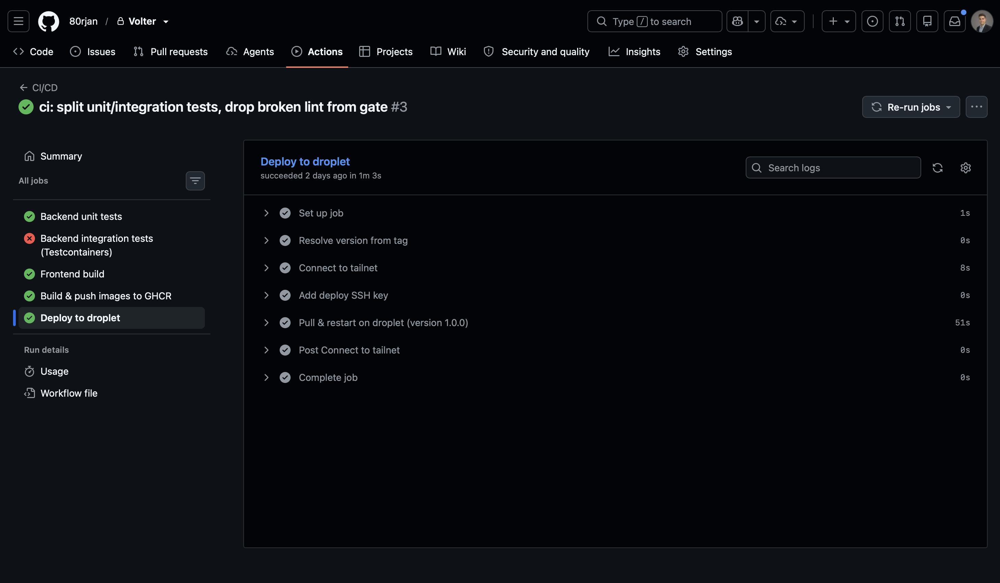

При посета на доменот, Cloudflare Access прво бара автентикација на корисникот, па потоа nginx проксира до frontend-от.
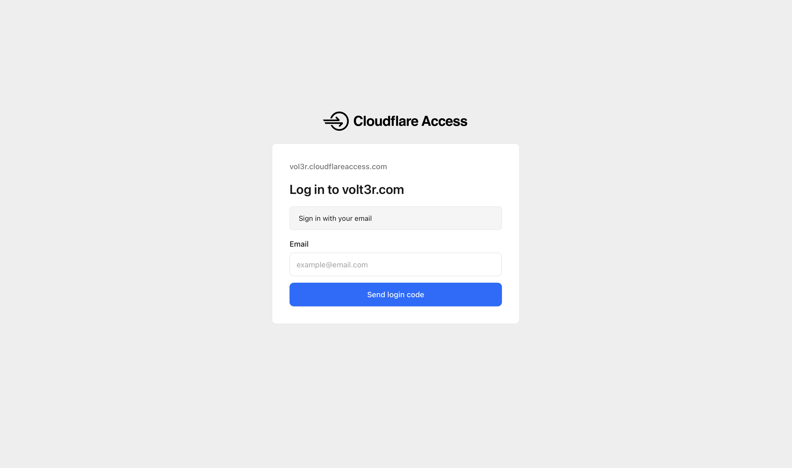


---

## 8. Дел 5 — Kubernetes (манифести и деплој на кластер)

Покрај Docker Compose на droplet-от, целиот стек може да се пушти и на **Kubernetes
кластер**. Истите GHCR имиџи (`volter-backend`, `volter-frontend`) повторно се користат —
Kubernetes само ги оркестрира поинаку: со декларативни манифести, автоматско крпење
(self-healing), повеќе replicas и вграден service discovery.

Сите манифести стојат во директориумот `k8s/`, нумерирани по редоследот на примена:

```
k8s/
├── 00-namespace.yaml             Namespace `volter`
├── 01-config.yaml                ConfigMap (не-тајна конфигурација)
├── 02-secrets.example.yaml       Secret (шаблон; вистинскиот е gitignored)
├── 03-postgres-statefulset.yaml  StatefulSet + headless Service за базата
├── 04-backend-deployment.yaml    Deployment за backend
├── 05-frontend-deployment.yaml   Deployment за frontend
├── 06-services.yaml              Service за backend и frontend
└── 07-ingress.yaml               Ingress (влез во кластерот)
```

> Базата е **StatefulSet** со `volumeClaimTemplates` (а не Deployment со рачен PVC), backend-от никогаш не е изложен
> преку Ingress туку само преку frontend nginx (ист origin како во прод), а самиот Service
> се вика `backend:8080` за да работи непроменет nginx-от од Docker имиџот.

### 8.1 Namespace — `k8s/00-namespace.yaml`

Сите ресурси се групирани во засебен namespace `volter`, изолиран од останатото во
кластерот. Така истите имиња (`backend`, `frontend`, `volter-postgres`) не се судираат со
други проекти, а врз namespace-от можат да се закачат квоти и мрежни политики.

```yaml
apiVersion: v1
kind: Namespace
metadata:
  name: volter
  labels:
    app.kubernetes.io/part-of: volter
```

### 8.2 Конфигурација и тајни — `k8s/01-config.yaml`, `k8s/02-secrets.example.yaml`

Конфигурацијата е поделена на два објекта според чувствителност:

- **ConfigMap** (`k8s/01-config.yaml`) — не-тајни вредности: име на база, Spring профил,
  JDBC URL, дозволени origins.
- **Secret** (`k8s/02-secrets.example.yaml`) — тајни: корисник/лозинка за базата, JWT
  тајна, API клуч. Во git стои само `.example` шаблонот со лажни вредности; вистинскиот
  `k8s/02-secrets.yaml` е во `.gitignore` и се применува рачно.

`k8s/01-config.yaml`:

```yaml
apiVersion: v1
kind: ConfigMap
metadata:
  name: volter-config
  namespace: volter
data:
  POSTGRES_DB: volterdb
  SPRING_PROFILES_ACTIVE: prod
  SPRING_DATASOURCE_URL: jdbc:postgresql://volter-postgres:5432/volterdb
  ALLOWED_ORIGINS: https://erp.volter.local
  TZ: Europe/Skopje
```

`k8s/02-secrets.example.yaml` (шаблон со лажни вредности):

```yaml
apiVersion: v1
kind: Secret
metadata:
  name: volter-secrets
  namespace: volter
type: Opaque
stringData:
  POSTGRES_USER: volter
  POSTGRES_PASSWORD: "<постави-силна-лозинка>"
  JWT_CONFIG_SECRET: "<openssl rand -base64 32>"
  GOLD_API_KEY: ""
```

Бидејќи GHCR имиџите се приватни, потребен е и **imagePullSecret** (не се committ-ира,
се создава директно во namespace-от):

```bash
kubectl create secret docker-registry ghcr-pull \
  --namespace volter \
  --docker-server=ghcr.io \
  --docker-username=80rjan \
  --docker-password='<PAT-со-read:packages>'
```

### 8.3 StatefulSet за базата — `k8s/03-postgres-statefulset.yaml`

Базата чува состојба, па наместо Deployment се користи **StatefulSet**. Тој дава:

- **стабилно име на pod** (`volter-postgres-0`),
- **стабилен диск** преку `volumeClaimTemplates` — секој pod добива сопствен
  PersistentVolumeClaim што преживува рестарт и репланирање на pod-от,
- **headless Service** (`clusterIP: None`) што му дава предвидлив DNS идентитет.

Backend-от потоа се поврзува на базата едноставно преку host `volter-postgres`
(дефинирано во ConfigMap-от како `SPRING_DATASOURCE_URL`).

```yaml
# Headless Service — стабилен DNS идентитет за pod-овите на StatefulSet-от.
apiVersion: v1
kind: Service
metadata:
  name: volter-postgres
  namespace: volter
  labels:
    app.kubernetes.io/name: postgres
    app.kubernetes.io/part-of: volter
spec:
  clusterIP: None          # headless: без виртуелно IP, директно кон pod-овите
  selector:
    app.kubernetes.io/name: postgres
  ports:
    - name: postgres
      port: 5432
      targetPort: postgres
---
apiVersion: apps/v1
kind: StatefulSet
metadata:
  name: volter-postgres
  namespace: volter
  labels:
    app.kubernetes.io/name: postgres
    app.kubernetes.io/part-of: volter
spec:
  serviceName: volter-postgres        # мора да одговара на headless Service-от
  replicas: 1
  selector:
    matchLabels:
      app.kubernetes.io/name: postgres
  template:
    metadata:
      labels:
        app.kubernetes.io/name: postgres
        app.kubernetes.io/part-of: volter
    spec:
      securityContext:
        fsGroup: 999                # postgres корисникот во официјалниот имиџ
      containers:
        - name: postgres
          image: postgres:16-alpine
          ports:
            - name: postgres
              containerPort: 5432
          env:
            - name: POSTGRES_USER
              valueFrom:
                secretKeyRef:
                  name: volter-secrets
                  key: POSTGRES_USER
            - name: POSTGRES_PASSWORD
              valueFrom:
                secretKeyRef:
                  name: volter-secrets
                  key: POSTGRES_PASSWORD
            - name: POSTGRES_DB
              valueFrom:
                configMapKeyRef:
                  name: volter-config
                  key: POSTGRES_DB
            - name: PGDATA
              value: /var/lib/postgresql/data/pgdata   # поддиректориум, не самиот mount
          volumeMounts:
            - name: pgdata
              mountPath: /var/lib/postgresql/data
          readinessProbe:
            exec:
              command: ["sh", "-c", "pg_isready -U \"$POSTGRES_USER\" -d \"$POSTGRES_DB\""]
            initialDelaySeconds: 10
            periodSeconds: 10
          livenessProbe:
            exec:
              command: ["sh", "-c", "pg_isready -U \"$POSTGRES_USER\" -d \"$POSTGRES_DB\""]
            initialDelaySeconds: 30
            periodSeconds: 15
          resources:
            requests:
              cpu: 100m
              memory: 256Mi
            limits:
              cpu: "1"
              memory: 1Gi
  volumeClaimTemplates: # суштината на StatefulSet: диск по replica
    - metadata:
        name: pgdata
      spec:
        accessModes: ["ReadWriteOnce"]
        resources:
          requests:
            storage: 5Gi

```

### 8.4 Deployment за апликацијата — `k8s/04-backend-deployment.yaml`, `k8s/05-frontend-deployment.yaml`

Backend-от и frontend-от се **stateless**, па се пакуваат како **Deployment** со по
`replicas: 2`. Deployment-от обезбедува rolling update без прекин и автоматско враќање на
саканиот број pod-ови. Конфигурацијата се вчитува од ConfigMap-от (`envFrom`) и од
Secret-от (`secretKeyRef`); здравјето се проверува со readiness/liveness probes на
`/actuator/health`.

`k8s/04-backend-deployment.yaml`:

```yaml
apiVersion: apps/v1
kind: Deployment
metadata:
  name: volter-backend
  namespace: volter
  labels:
    app.kubernetes.io/name: backend
    app.kubernetes.io/part-of: volter
spec:
  replicas: 2
  selector:
    matchLabels:
      app.kubernetes.io/name: backend
  template:
    metadata:
      labels:
        app.kubernetes.io/name: backend
        app.kubernetes.io/part-of: volter
    spec:
      # GHCR имиџите се приватни → потребен е imagePullSecret
      imagePullSecrets:
        - name: ghcr-pull
      containers:
        - name: backend
          image: ghcr.io/80rjan/volter-backend:latest
          ports:
            - name: http
              containerPort: 8080
          envFrom:
            - configMapRef:
                name: volter-config         # SPRING_PROFILES_ACTIVE, SPRING_DATASOURCE_URL, ...
          env:
            - name: SPRING_DATASOURCE_USERNAME
              valueFrom:
                secretKeyRef:
                  name: volter-secrets
                  key: POSTGRES_USER
            - name: SPRING_DATASOURCE_PASSWORD
              valueFrom:
                secretKeyRef:
                  name: volter-secrets
                  key: POSTGRES_PASSWORD
            - name: JWT_CONFIG_SECRET
              valueFrom:
                secretKeyRef:
                  name: volter-secrets
                  key: JWT_CONFIG_SECRET
            - name: GOLD_API_KEY
              valueFrom:
                secretKeyRef:
                  name: volter-secrets
                  key: GOLD_API_KEY
          readinessProbe:
            httpGet:
              path: /actuator/health
              port: http
            initialDelaySeconds: 30
            periodSeconds: 10
          livenessProbe:
            httpGet:
              path: /actuator/health
              port: http
            initialDelaySeconds: 60
            periodSeconds: 15
          resources:
            requests:
              cpu: 250m
              memory: 512Mi
            limits:
              cpu: "1"
              memory: 1Gi
```

`k8s/05-frontend-deployment.yaml`:

```yaml
apiVersion: apps/v1
kind: Deployment
metadata:
  name: volter-frontend
  namespace: volter
  labels:
    app.kubernetes.io/name: frontend
    app.kubernetes.io/part-of: volter
spec:
  replicas: 2
  selector:
    matchLabels:
      app.kubernetes.io/name: frontend
  template:
    metadata:
      labels:
        app.kubernetes.io/name: frontend
        app.kubernetes.io/part-of: volter
    spec:
      imagePullSecrets:
        - name: ghcr-pull
      containers:
        - name: frontend
          image: ghcr.io/80rjan/volter-frontend:latest
          ports:
            - name: http
              containerPort: 80
          readinessProbe:
            httpGet:
              path: /
              port: http
            initialDelaySeconds: 5
            periodSeconds: 10
          livenessProbe:
            httpGet:
              path: /
              port: http
            initialDelaySeconds: 15
            periodSeconds: 20
          resources:
            requests:
              cpu: 50m
              memory: 64Mi
            limits:
              cpu: 250m
              memory: 128Mi
```

### 8.5 Service за апликацијата — `k8s/06-services.yaml`

Двата Deployment-а се изложени внатре во кластерот преку **ClusterIP Service**-и —
стабилно име + распределба на товар меѓу replicas. Клучен детаљ: backend Service-от
**мора** да се вика `backend` и да слуша на `8080`, бидејќи nginx во frontend имиџот
проксира на `http://backend:8080/` (`frontend/nginx.conf`). Така истиот имиџ работи
непроменет и во Compose и во Kubernetes.

```yaml
apiVersion: v1
kind: Service
metadata:
  name: backend           # nginx во frontend бара точно ова име
  namespace: volter
  labels:
    app.kubernetes.io/name: backend
    app.kubernetes.io/part-of: volter
spec:
  type: ClusterIP
  selector:
    app.kubernetes.io/name: backend
  ports:
    - name: http
      port: 8080
      targetPort: http
---
apiVersion: v1
kind: Service
metadata:
  name: frontend
  namespace: volter
  labels:
    app.kubernetes.io/name: frontend
    app.kubernetes.io/part-of: volter
spec:
  type: ClusterIP
  selector:
    app.kubernetes.io/name: frontend
  ports:
    - name: http
      port: 80
      targetPort: http

```

Преглед на сите Service-и:

| Service           | Тип       | Порта | Што изложува              |
|-------------------|-----------|-------|---------------------------|
| `volter-postgres` | Headless  | 5432  | StatefulSet (само внатре) |
| `backend`         | ClusterIP | 8080  | backend Deployment        |
| `frontend`        | ClusterIP | 80    | frontend Deployment       |

### 8.6 Ingress за апликацијата — `k8s/07-ingress.yaml`

**Ingress**-от е единствената влезна точка однадвор во кластерот. Целиот сообраќај за
host-от `erp.volter.local` се рутира кон `frontend` Service-от; nginx внатре во
frontend-от потоа сам го проксира `/api` кон `backend` Service-от. Така backend-от
**никогаш не е директно изложен** преку Ingress — истата логика на ист origin како во
продукцијата со Cloudflare.

```yaml
apiVersion: networking.k8s.io/v1
kind: Ingress
metadata:
  name: volter
  namespace: volter
  labels:
    app.kubernetes.io/part-of: volter
  annotations:
    nginx.ingress.kubernetes.io/proxy-body-size: "10m"
spec:
  ingressClassName: nginx
  rules:
    - host: erp.volter.local        # мапирај го кон IP-то на кластерот во /etc/hosts
      http:
        paths:
          - path: /
            pathType: Prefix
            backend:
              service:
                name: frontend
                port:
                  number: 80
```

> Ingress-от бара инсталиран ingress-nginx контролер. На minikube се вклучува со
> `minikube addons enable ingress`.

### 8.7 Деплој на кластерот и демонстрација

Целиот стек се применува во namespace-от `volter` со неколку команди:

```bash
# 1. (еднократно) создавање на тајните што не се во git
kubectl apply -f k8s/00-namespace.yaml
kubectl create secret docker-registry ghcr-pull -n volter \
  --docker-server=ghcr.io --docker-username=80rjan --docker-password='<PAT>'
cp k8s/02-secrets.example.yaml k8s/02-secrets.yaml   # внеси вистински вредности
kubectl apply -f k8s/02-secrets.yaml

# 2. примена на сите манифести
kubectl apply -f k8s/

# 3. проверка дека сè е горе
kubectl get all -n volter
kubectl get pvc,ingress,configmap,secret -n volter
kubectl rollout status statefulset/volter-postgres -n volter
kubectl rollout status deployment/volter-backend -n volter

# 4. отворање во прелистувач (host-от се мапира во /etc/hosts кон IP на кластерот)
#    echo "$(minikube ip) erp.volter.local" | sudo tee -a /etc/hosts
```

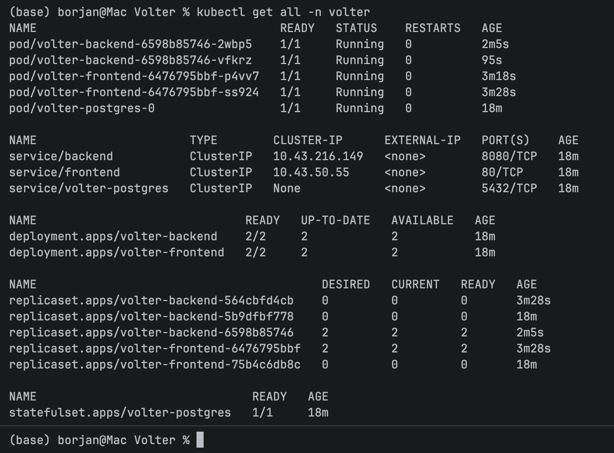
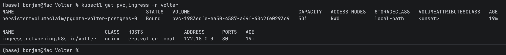
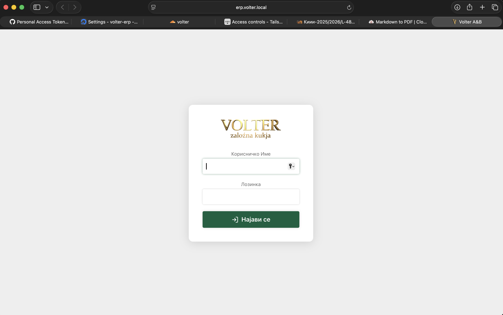

---

## 9. Инфраструктура и безбедност во детали

Целото поставување е изградено околу едно правило: **серверот не отвора ниту еден влезен
порт кон јавниот интернет.** До сè се доаѓа преку контролирани канали што се иницираат
одвнатре (излезно).

### 9.1 DigitalOcean droplet

Продукцискиот хост е **DigitalOcean droplet** — мал Ubuntu виртуелен сервер со Docker и
Compose plugin. На него се врти стекот од четири контејнери дефиниран во
`docker-compose.prod.yml`. Прикачен е **DigitalOcean Cloud Firewall** со:

- **Влезно:** само SSH (22) (а и до тоа практично се доаѓа преку Tailscale).
- **Излезно:** сè (`cloudflared` и Tailscale клиентите мора да се поврзуваат нанадвор).

Бидејќи ништо друго не е објавено, droplet-от практично е **невидлив** за јавниот
интернет — нема веб-порт за скенирање или напаѓање.


### 9.2 Cloudflare Tunnel — како апликацијата е достапна без отворени порти

Вообичаено, веб-сервер мора да отвори порт 80/443 за да може светот да се поврзе — што
истовремено значи дека целиот интернет може да го напаѓа тој порт, а и IP-то на серверот
е изложено.

**Cloudflare Tunnel** го превртува тоа наопаку. `cloudflared` контејнерот се поврзува
**нанадвор** кон Cloudflare и ја држи таа врска отворена. Сообраќајот од посетителите
пристигнува на **работ на Cloudflare** (DNS-от на доменот покажува кон Cloudflare, не
кон droplet-от) и се враќа назад низ таа веќе отворена врска до `cloudflared`, кој потоа
го препраќа до `frontend` контејнерот по име (`frontend:80`).

```
посетител ─► Cloudflare раб ─┐
                             │  (постоечки излезен тунел)
                   cloudflared (во droplet) ─► frontend:80 (nginx)
```

Резултатот: **на droplet-от нема влезен порт, вистинското IP е скриено, и целиот
сообраќај е принуден да помине низ Cloudflare** — каде што сообраќајот дополнително може
да се автентицира.

### 9.3 Cloudflare Access (Zero Trust) — кому му е дозволено да влезе

Cloudflare Access е **идентитетска порта што работи внатре во Cloudflare, пред самата
апликација**. Пред кое било барање да стигне до тунелот, посетителот мора да се
автентицира (еднократен PIN преку е-пошта) и да задоволи некоја Access политика. „Zero
trust" значи дека секое барање се проверува според тоа *кој е корисникот*, а не според
тоа дали се наоѓа на некоја „доверлива" мрежа.

Пример со множество политики (победува првата што се совпаѓа со **Allow**, сè друго се
одбива):

| Политика     | Дејство | Include (кој)                        | Require (дополнителен AND-услов) |
|--------------|---------|--------------------------------------|----------------------------------|
| Супер админ  | Allow   | е-пошта на админот                   | —                                |
| Продавница 1 | Allow   | е-пошти на вработени во продавница 1 | јавно IP на продавница 1 `/32`   |
| Продавница 2 | Allow   | е-пошти на вработени во продавница 2 | јавно IP на продавница 2 `/32`   |

Со ова, вработените во продавница влегуваат само со дозволена **е-пошта И од IP-то на
продавницата**, додека супер админот влегува само со неговата е-пошта, но од било каде.


### 9.4 Tailscale — како CI поставува без отворен SSH порт

CD job-от го има истиот проблем како и обичниот посетител: треба да го достигне
droplet-от, а droplet-от нема јавен SSH порт. Решението е **Tailscale**, mesh VPN
изграден врз WireGuard.

- Droplet-от се приклучува на приватен **tailnet**.
- GitHub Actions runner-от се приклучува на **истиот tailnet** во моментот на
  поставување, користејќи Tailscale **OAuth client** — роботски идентитет што креира
  краткотраен, **привремен (ephemeral)** node обележан со `tag:ci`. Тој node исчезнува
  штом job-от ќе заврши.
- ACL правилото дозволува `tag:ci` да SSH-ува до droplet-от. Внатре во tailnet-от,
  runner-от доаѓа до droplet-от преку неговата приватна Tailscale адреса
  (`DROPLET_HOST`), а SSH автентикацијата со клуч го докажува идентитетот.

Зошто Tailscale, а не само „SSH преку Cloudflare тунелот"? Контејнеризираниот
`cloudflared` проксира HTTP до `frontend` контејнерот; тој не може да го достигне SSH
daemon-от на **самиот хост** без host networking. Tailscale му дава на CI runner-от
директен, шифриран и автентициран пристап до хостот **без влезен порт** — истата
позиција на нулта изложеност како кај Cloudflare тунелот, само за патеката на
поставување.

### 9.5 Одбрана во длабочина — слоевите заедно

Едно барање да се направи нешто во апликацијата минува низ **четири независни порти**:

1. **Cloudflare Access** — смее ли воопшто оваа личност да ја достигне страницата?
   (идентитет + IP)
2. **Најава во апликацијата (JWT)** — дали барателот е валиден Volter корисник?
3. **Улоги / дозволи** — дали баш на овој корисник му е дозволено да го изврши *ова*
   дејство?
4. **DigitalOcean firewall + ниту еден објавен порт** — самиот сервер е недостапен, освен
   преку контролираните канали погоре.

Дури и ако еден слој е лошо конфигуриран, другите сепак држат.

---

## 10. Управување со тајни и конфигурација

Ништо чувствително не е committ-ирано. Тајните стојат на две места:

**На droplet-от — `.env.prod`** (gitignored), што го користи Compose:

| Променлива                                            | Намена                                                                      |
|-------------------------------------------------------|-----------------------------------------------------------------------------|
| `POSTGRES_USER` / `POSTGRES_PASSWORD` / `POSTGRES_DB` | податоци за пристап до базата                                               |
| `JWT_CONFIG_SECRET`                                   | тајна за потпишување на токени за автентикација (`openssl rand -base64 32`) |
| `ALLOWED_ORIGINS`                                     | CORS origin (за секој случај; во прод апликацијата е на ист origin)         |
| `GOLD_API_KEY`                                        | goldapi.io клуч за цена на злато во живо (опционален)                       |
| `TUNNEL_TOKEN`                                        | акредитив за Cloudflare тунелот                                             |

> Spring **профилот не е во `.env.prod`** — `SPRING_PROFILES_ACTIVE: prod` е тврдо
> запишан во compose датотеката, па ниедна лоша env датотека не може случајно да ја
> префрли продукцијата во dev / демо-сеедирачки режим.

**Во GitHub — тајни на репозиториумот за Actions**, што ги користи pipeline-от:

| Тајна                                    | Намена                                                                          |
|------------------------------------------|---------------------------------------------------------------------------------|
| `GITHUB_TOKEN` (вграден)                 | качување имиџи на GHCR — нема рачна тајна потребна                              |
| `TS_OAUTH_CLIENT_ID` / `TS_OAUTH_SECRET` | Tailscale OAuth client (runner-от се приклучува на tailnet-от)                  |
| `DROPLET_HOST`                           | Tailscale адреса / MagicDNS име на droplet-от                                   |
| `DROPLET_USER`                           | SSH корисник на droplet-от                                                      |
| `DROPLET_SSH_KEY`                        | **приватниот** deploy клуч (јавниот клуч е во `authorized_keys` на droplet-от)  |
| `DROPLET_PROJECT_DIR`                    | апсолутна патека на droplet-от каде што стојат compose датотеката + `.env.prod` |

Освен тоа, droplet-от прави **еднократен** `docker login ghcr.io` со personal access
token ограничен само на `read:packages`, за да може да ги повлекува приватните имиџи:

```bash
echo "<PAT-со-read:packages>" | docker login ghcr.io -u 80rjan --password-stdin
```

> Забелешка: автентикацијата кон регистарот оди преку HTTPS со токен — **SSH клуч не
> може да автентицира Docker регистар**. SSH клучот служи само за deploy job-от да се
> најави на хостот; GHCR токенот е тоа што му дозволува на хостот да *повлекува* имиџи.

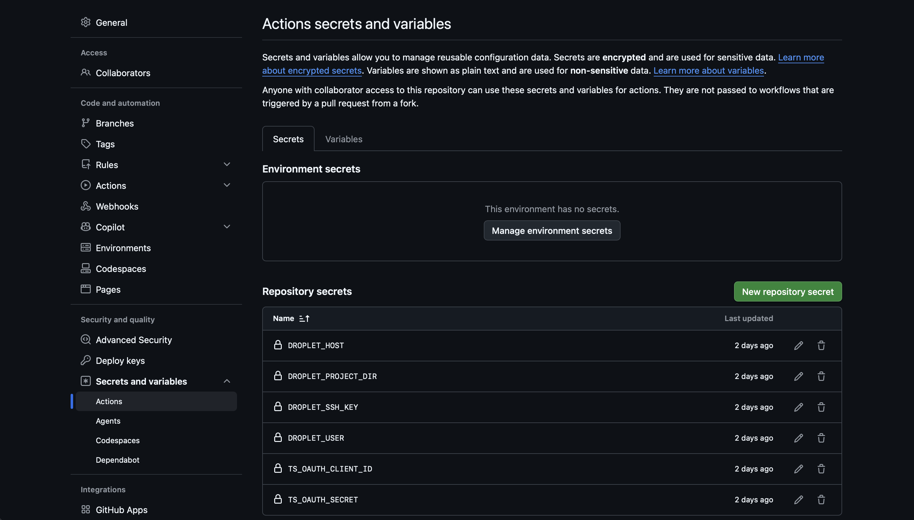

---

## 11. Целосен тек на едно издание (release)

Кога сето ова ќе се спои, еве што точно се случува кога се испорачува нова верзија:

```
1. Развивач:  git tag v1.1.0 && git push origin v1.1.0
                         │
2. GitHub Actions стартува (тригер: таг v*.*.*)
   ├─ backend-test ......... unit тестови (Surefire)         ┐
   ├─ backend-it ........... integration тестови (Testcontainers, не-блокирачки)
   └─ frontend-check ....... npm ci + npm run build          ┘  контрола на квалитет
                         │  (сè зелено)
3. build-and-push
   ├─ docker login ghcr.io (GITHUB_TOKEN)
   ├─ изгради backend имиџ  → качи таг-ови 1.1.0, 1.1, 1, latest, sha-…
   └─ изгради frontend имиџ → качи таг-ови 1.1.0, 1.1, 1, latest, sha-…  (VITE_API_BASE=/api)
                         │
4. deploy  (само бидејќи ова е v* таг)
   ├─ tailscale up (OAuth, tag:ci)  → runner-от се приклучува на tailnet-от
   ├─ ssh во droplet преку Tailscale (приватно, без отворен порт)
   └─ на droplet:
        IMAGE_TAG=1.1.0 docker compose pull   → повлечи 1.1.0 имиџи од GHCR
        IMAGE_TAG=1.1.0 docker compose up -d  → пресоздади ги сменетите контејнери
        docker image prune -f                 → исчисти стари слоеви
                         │
5. Во живо: postgres (здрав) ◄ backend (здрав) ◄ frontend (nginx)
            cloudflared ──излезно──► Cloudflare раб ──► корисници (по Access најава)
```

Сè на сè, развивачот прави **еден `git push` на таг.** Сето останато е автоматизирано.

Рачните операции се секогаш достапни кога ќе затреба (од droplet-от):

```bash
# Враќање на позната-добра верзија
IMAGE_TAG=1.0.0 docker compose --env-file .env.prod -f docker-compose.prod.yml pull
IMAGE_TAG=1.0.0 docker compose --env-file .env.prod -f docker-compose.prod.yml up -d

# Преглед на логови / рестарт на еден сервис
docker compose --env-file .env.prod -f docker-compose.prod.yml logs -f backend
docker compose --env-file .env.prod -f docker-compose.prod.yml restart backend

# Резервна копија на базата
docker exec volter_db_prod pg_dump -U "$POSTGRES_USER" "$POSTGRES_DB" > backup.sql
```

---
